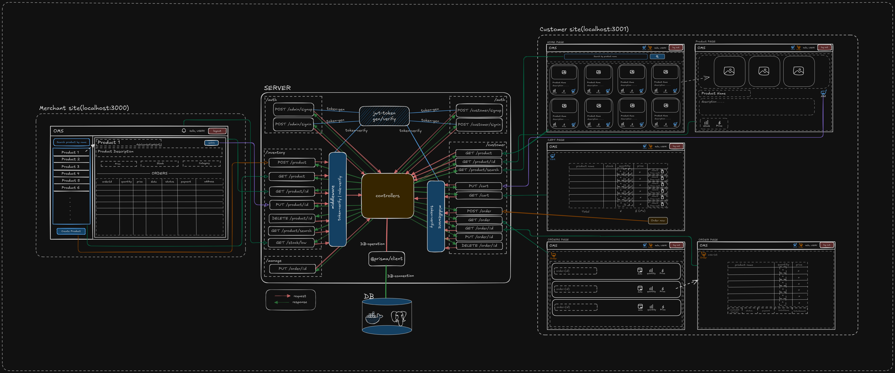
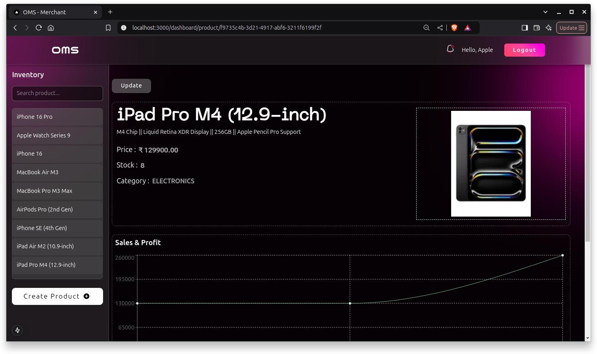
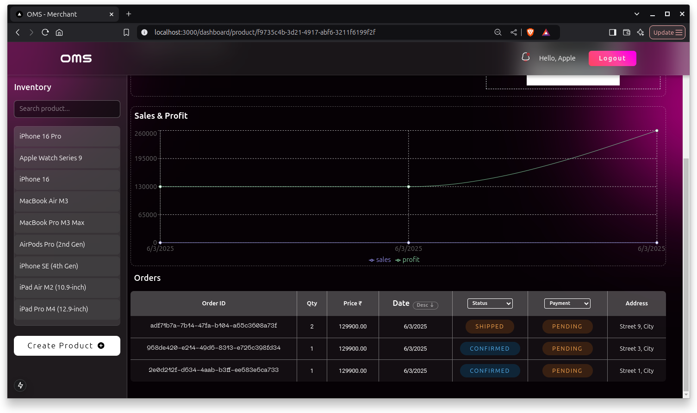
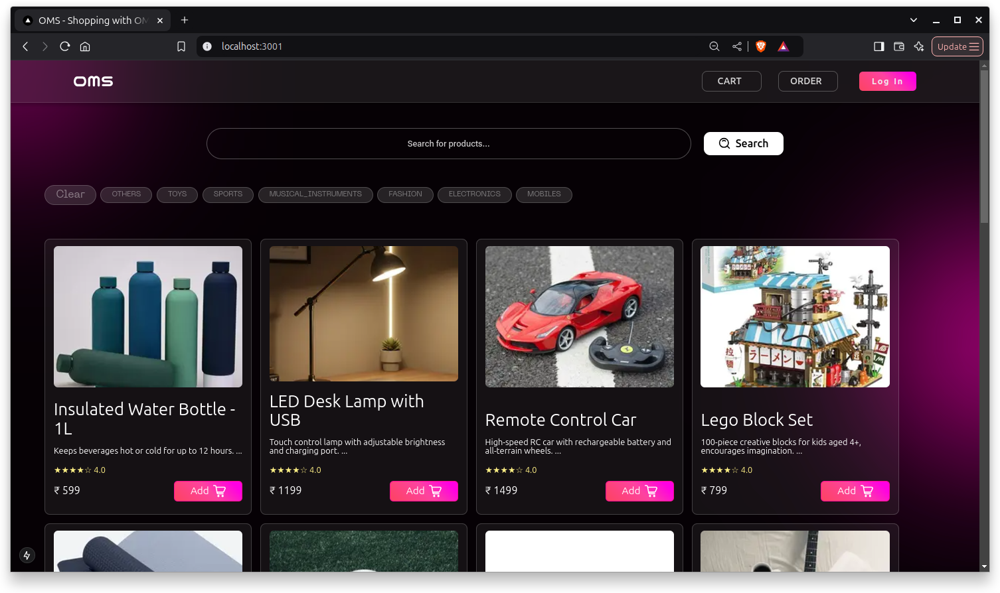
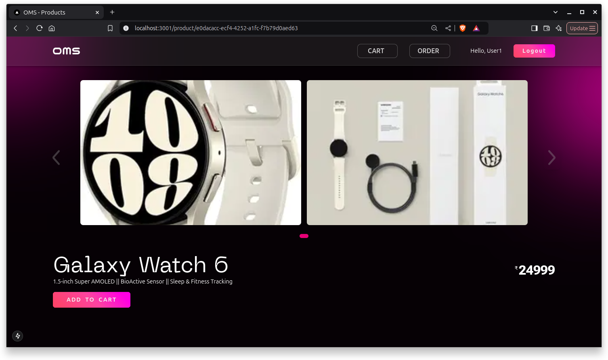
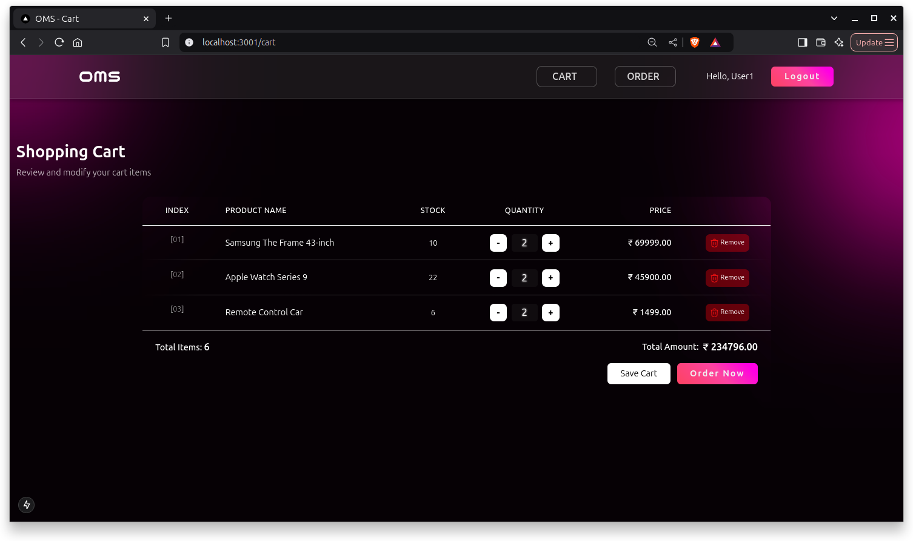
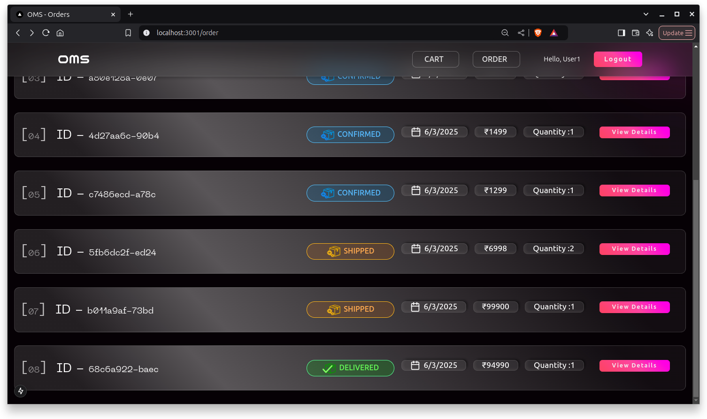
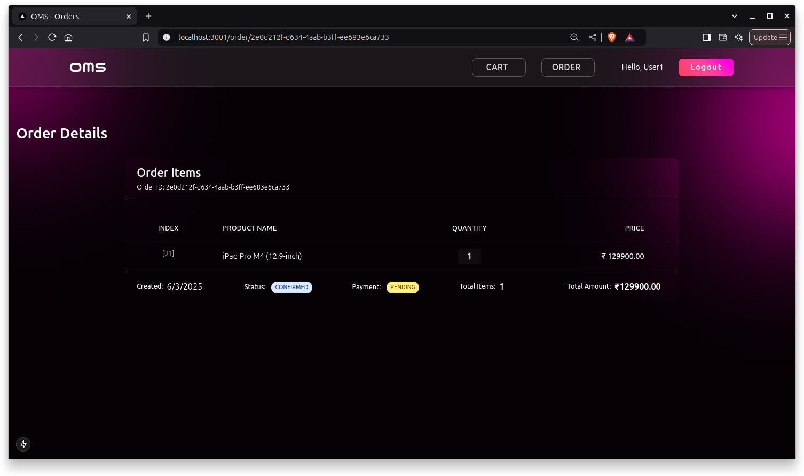

<div align="center">

# OMS

### The Order Management System


 </div>



## Features 🧪

### 🔐 Authentication

- secure user signin/signup with api routes
- successful signin/signup generate auth token that will be store on cookies
- all merchant routes are protected for admin roles only.
- all routes are protected, only register user.

### 👨‍💼 Merchant Dashboard

- add or list new products
- view product details such as name, category, stock, price.
- view orders of each product on product page.
- low stock notification.

### 🛒 Customer site

- view all products & details
- add multiple products in cart & it will sync
- place order with one click
- track order status on order list

## Run the App locally 🏃

### ⬇️ Clone the repo

```bash
git clone https://github.com/alfaarghya/oms.git

# or

git clone git@github.com:alfaarghya/oms.git

```

### 🛠️ Install Dependencies

```bash
cd oms        # go to oms folder
yarn install  # install dependencies
```

### 🔒 fill all of the `.env` files

```bash
#db's env
cd packages/db/
cp .env.example .env
cd ../..

#server's env
cd apps/server/
cp .env.example .env
cd ../..
```

### 🐳 connect the db

```bash
#starting the postgres db with docker
docker run -e POSTGRES_PASSWORD=omsadminpassward -p 5432:5432 -d postgres

#migrate db
yarn run db:migrate

#generate client
yarn run db:generate

#optional - show the actual db
yarn run db:show
```

### 🌱 Seed the db

after running this `yarn run db:migrate` something like this will appear -

```bash
Running seed command `ts-node prisma/seed.ts` ...
Database seeded successfully!

🌱  The seed command has been executed.
```

if, this does not seem to be appear on the terminal, run the below command

```bash
yarn run db:seed
```

### 🏃 Run the application

```bash
yarn run dev
```

## Demos

### 1. Landing Page


### 2. Merchant Dashboard




### 3. Product Page




### 4. Cart Page



### 5. Order Page



